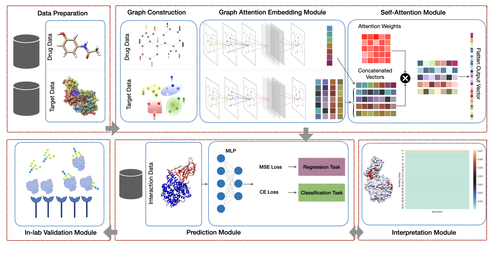

# Exciting News Ahead!

:sparkles: **Coming Soon**: We are thrilled to announce that a new project, the [DeepDrugDomain Package](https://github.com/yazdanimehdi/deepdrugdomain), is in the works! While this current repository has served us well, we're gearing up for an exciting transition to a more advanced and feature-rich package.

The DeepDrugDomain Package will offer enhanced capabilities for drug-target interaction and affinity prediction, integrating the latest advancements in the field. Although the repository is not public yet, we're just putting on the finishing touches.

Keep an eye on this page for future updates and the big reveal!

Thank you for your interest and support!

# AttentionSiteDTI
[](https://paperswithcode.com/sota/drug-discovery-on-bindingdb?p=attentionsitedti-an-interpretable-graph-based)

This is The repository for supporting matterial of "AttentionSiteDTI: an interpretable graph-based model for drug-target interaction prediction using NLP sentence-level relation classification"
https://academic.oup.com/bib/advance-article/doi/10.1093/bib/bbac272/6640006



## Requirements
A suitable [conda](https://conda.io/) environment can be created:
```
conda env create -f noveldti.yml
conda activate noveldti
```
## Data
All data used in this paper are publicly available and can be accessed here: [DUD-E](http://dude.docking.org ), [BindingDB-IBM dataset](https://github.com/IBM/InterpretableDTIP), [Human dataset](https://github.com/masashitsubaki/CPI_prediction/tree/master/dataset) and [human sequence to pdb](https://github.com/prokia/drugVQA/tree/master/data)

## Demo Instructions
After downloading the human dataset you and place it in the project root folder you can generate the preprocessed data by running
```
python human_data.py
```
After generating the human_part_train.pkl, human_part_val.pkl and human_part_test.pkl you can start training the model by running
```
python main2.py
```
# Cite
If you find this repo to be useful, please cite our paper. Thank you.
```
@article{yazdani2022attentionsitedti,
  title={AttentionSiteDTI: an interpretable graph-based model for drug-target interaction prediction using NLP sentence-level relation classification},
  author={Yazdani-Jahromi, Mehdi and Yousefi, Niloofar and Tayebi, Aida and Kolanthai, Elayaraja and Neal, Craig J and Seal, Sudipta and Garibay, Ozlem Ozmen},
  journal={Briefings in Bioinformatics}
}
```


